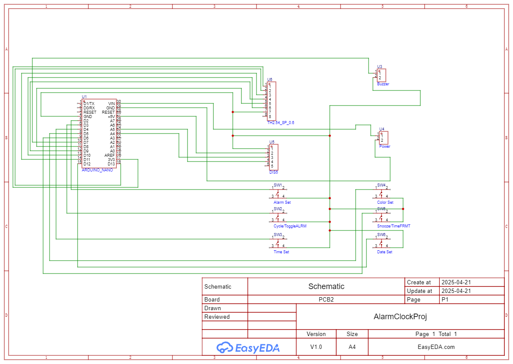
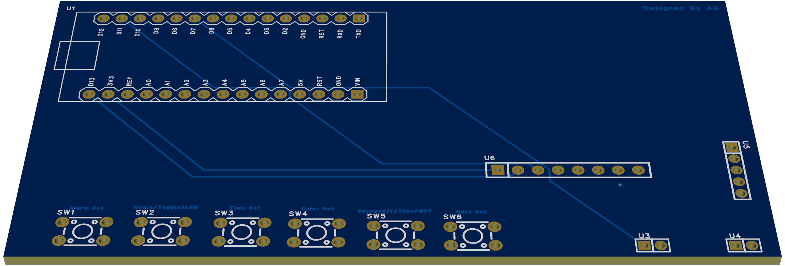
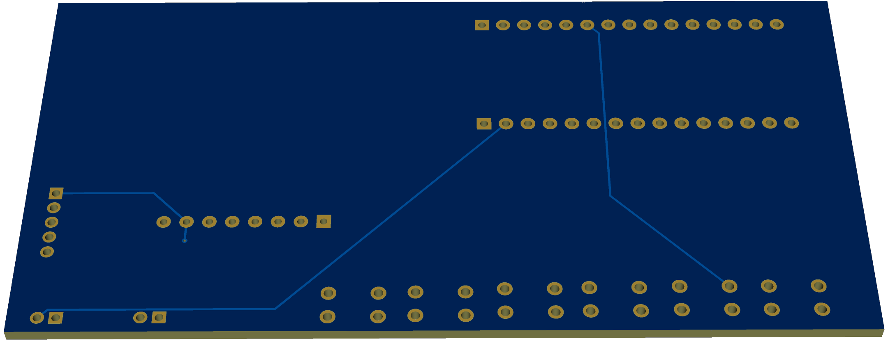

# Arduino Alarm Clock

A full-featured alarm clock built with:
- 1.44″ SPI TFT display (ST7735)  
- RTC module (DS3231)  
- EEPROM-backed settings  
- Snooze and multiple alarms  
- Custom melodies (Buzzer, Star Wars, Harry Potter, Pink Panther) 
- Multiple color choices for time and date

## User Manual

 Download:
- [UserManual.pdf](UserManual/Arduino_Alarm_Clock_UM.pdf)

## Code

Browse the Arduino sketch: [code/AlarmClock.ino](code/Date_Mate_code.ino)

## Schematic

Download: 
- [PDF export](schematic/Schematic.pdf)

## PCB Layout

 Download:
- [PNG export](pcb/PCB.png)

- [PNG export](pcb/PCB1.png)

## Photos

  

