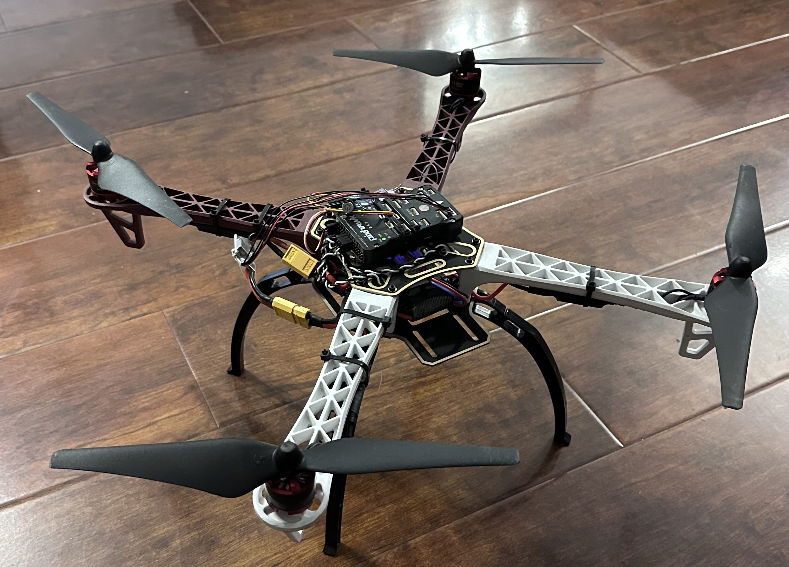
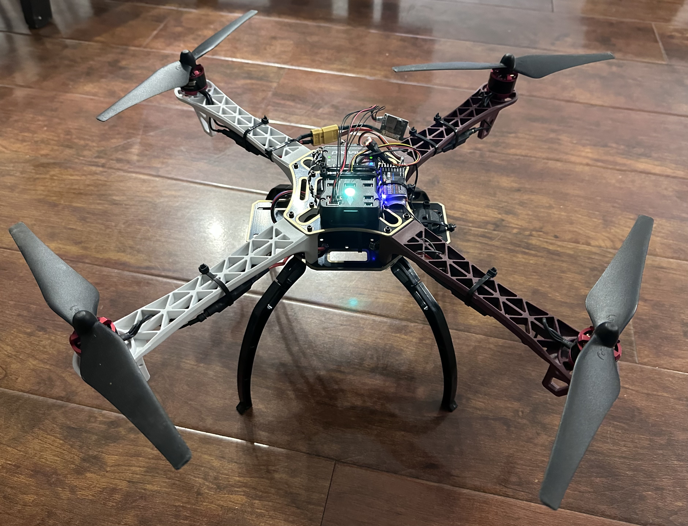
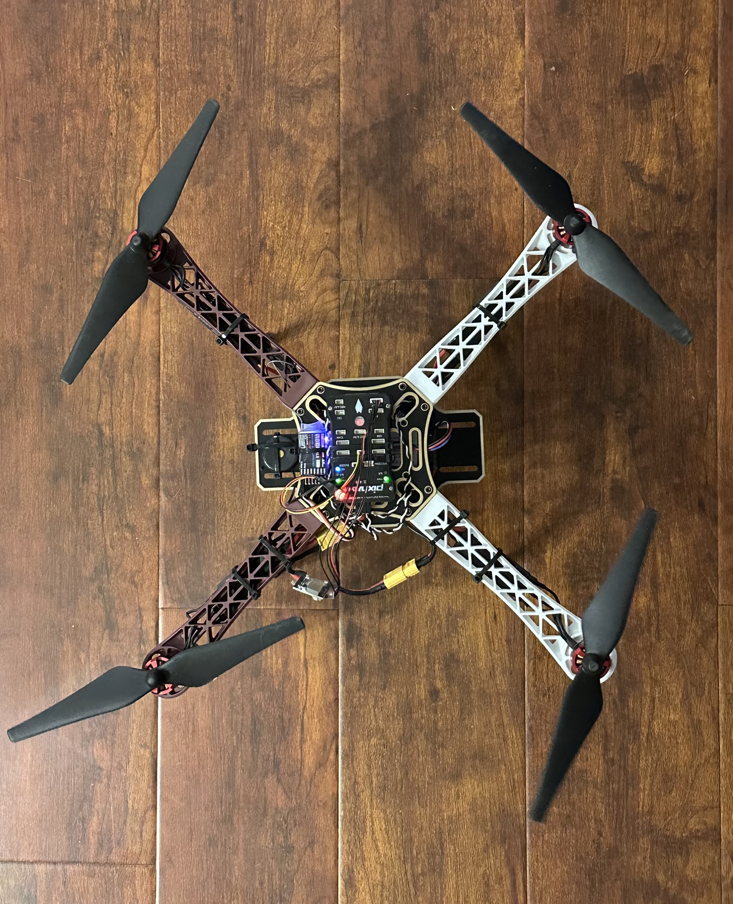
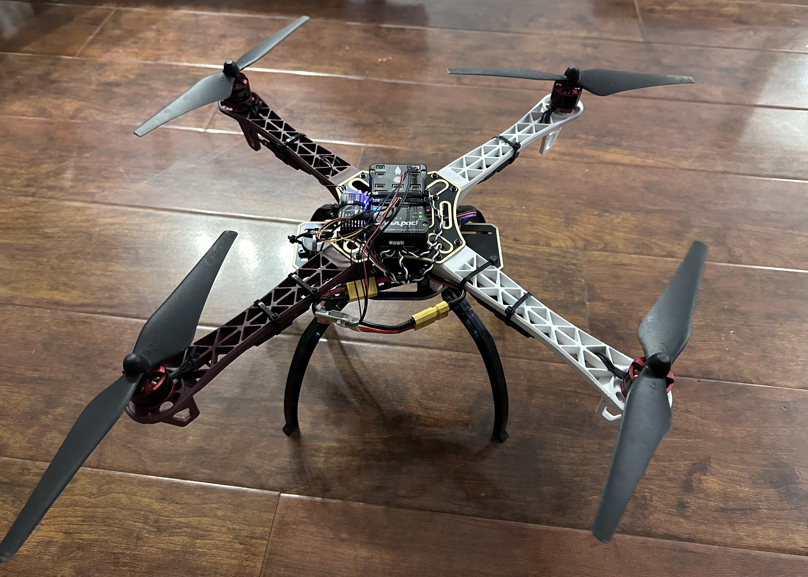

# Quadcopter

A custom-built quadcopter drone by Arvin Ghaloosian, designed for flight testing, embedded system development, and RC control experimentation:

F450 quadcopter frame with durable plastic arms and integrated landing gear

ReadyToSky 2212 920KV brushless motors and 30A OPTO ESCs, ideal for stable thrust and efficient flight

Radiolink T8S transmitter and R8EF 8-channel receiver for precise manual control

Pixhawk PX4 2.4.8 flight controller with support for GPS, telemetry, and autonomous modes

Power module with 5.3V BEC for powering the Pixhawk and sensing battery voltage/current

3S 2200mAh 30C LiPo battery with XT60 connector for powering motors and electronics

GEMFAN 9443 propellers matched to motor KV rating for balanced lift and efficiency

Hiyiton V6 balance charger for proper LiPo maintenance and extended battery life

Fully compatible with Mission Planner, QGroundControl, and MAVLink for autonomous waypoint control and telemetry feedback

## Parts

- [Parts Used](components/Parts.pdf)  

## Mission Planner Configuration

I used ArduPilot’s Mission Planner to configure and tune my PX4/Pixhawk autopilot.  
- Loaded custom `parameters.param` (link below)  
- Set flight‑controller parameters for stable hover, yaw control, and RTL fail‑safe  
- Tuned PID loops for roll, pitch, and altitude  

**Download full parameter file:**  
[Drone/missionplanner/parameters.param](missionplanner/Parameters.param)  

## Photos

  
 
 
 
