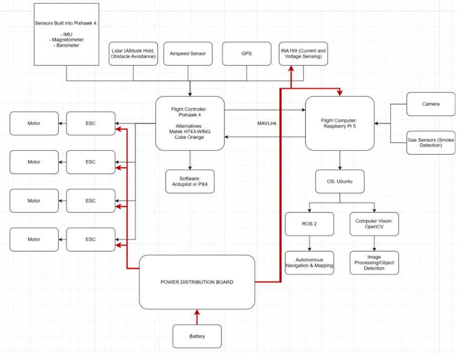
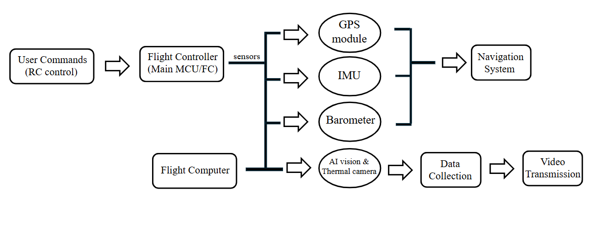
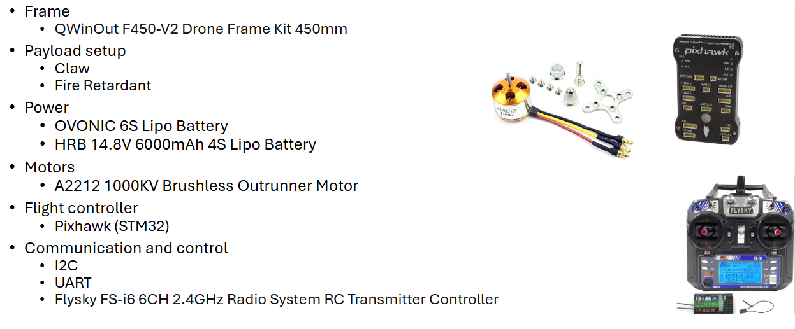
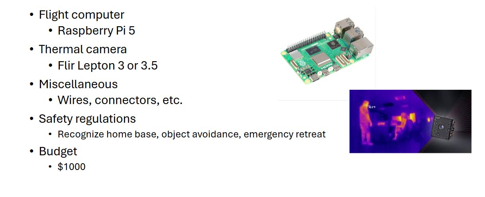

# Autonomous AI Firefighting Drone

Smoke Detection: Detect simulated smoke (10-20m).​

Thermal Imaging: Display live thermal feed, detect heat
sources (5-10m).​

Real-time Video: Transmit live standard video to ground
station.​

Manual Control: Reliable remote control for basic
maneuvers.​

Stable Flight: Stable hover and flight.​

Flight Time: Achieve 10-15 minutes of flight time.​

Safety Features: Emergency landing procedure and
"Homebase" waypoint.​

Ground Station: Display video, thermal (if possible), GPS,
telemetry data, and fire alert.​

Smoke Detection: Detect simulated smoke (10-20m).​

Thermal Imaging: Display live thermal feed, detect heat
sources (5-10m).​

Real-time Video: Transmit live standard video to ground
station.​

Manual Control: Reliable remote control for basic
maneuvers.​

Stable Flight: Stable hover and flight.​

Flight Time: Achieve 10-15 minutes of flight time.​

Safety Features: Emergency landing procedure and
"Homebase" waypoint.​

Ground Station: Display video, thermal (if possible), GPS,
telemetry data, and fire alert.​

## Schematic

  

## Components

  

## Photos

Comming Soon

