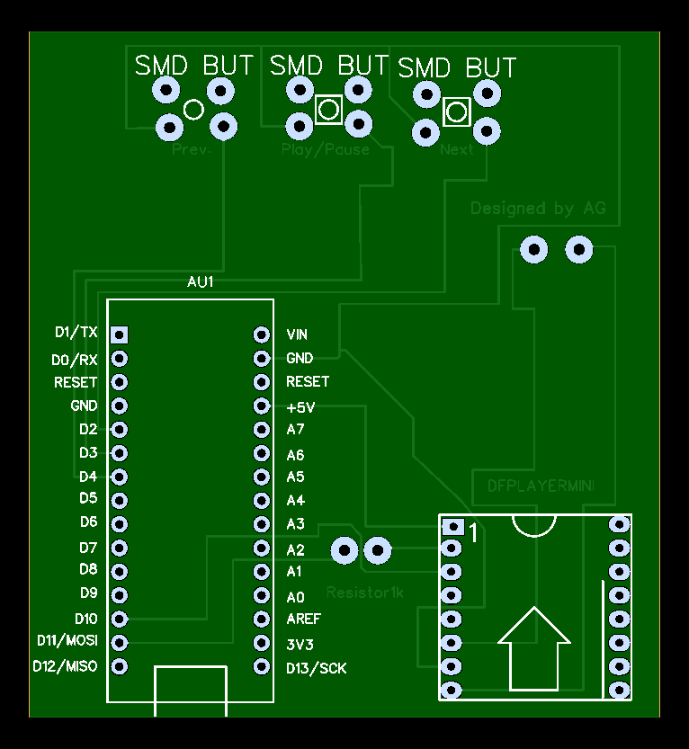

# MP3 Player Using SD card

A simple audio‑playback interface built around the DFPlayer Mini TF‑Module:

- DFPlayer Mini decoder reads MP3/WAV from microSD card  
- Three push‑buttons for Previous, Play/Pause, and Next track  
- On‑board microSD card slot with spring‑push eject  
- TTL serial control pins broken out for advanced playback control  
- Stereo speaker output header (or mono via jumper)  
- Standard Arduino‑UNO pin footprint for easy prototyping   

## PCB Layout

 Download:
- [PNG export](pcb/PCB.png)

## Photos

  
