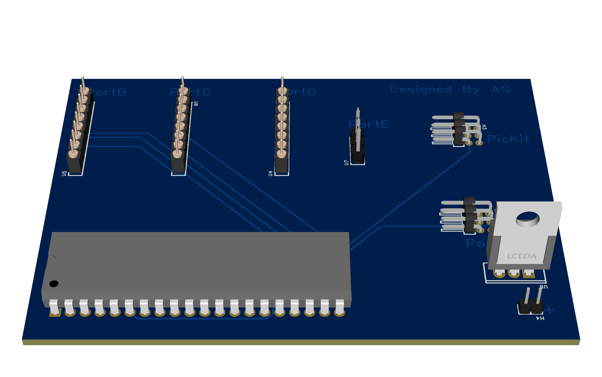
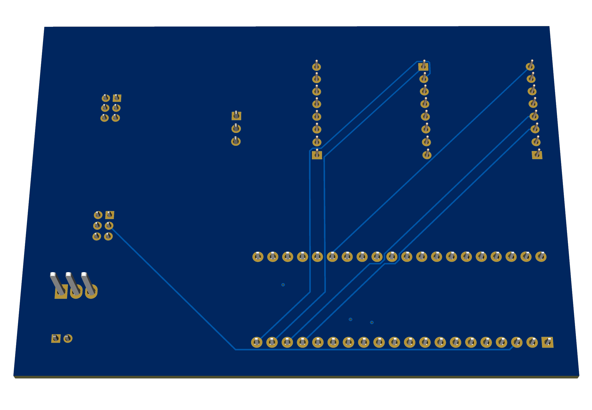

# PIC18f4620 Programming Board

A simple development interface for the PIC18F4620 by Arvin Ghaloosian that makes programming easier and brings all the chip’s pins out to headers:

- ICSP header for in‑circuit programming/debugging  
- Breakouts for every PortA–PortE pin  
- On‑board 5 V regulator (L7805) with power connector  
- Ready for use with MPLAB X and PICkit  

## Schematic

Download: 
- [PDF export](schematic/schematic.pdf)

## PCB Layout

 Download:
- [PNG export](pcb/PCB.png)

- [PNG export](pcb/PCB1.png)

## Photos

  

