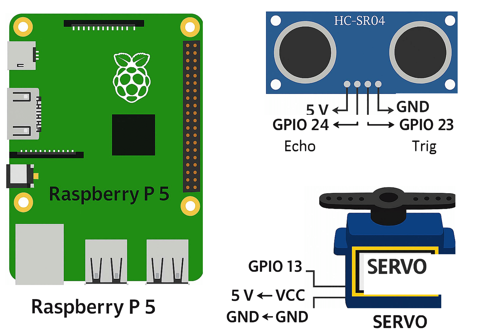
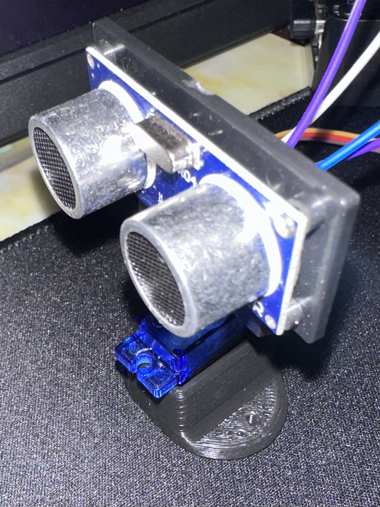

## 📡 PiRadar

A real-time semicircular radar interface built with **Python** and **Pygame**, running on a **Raspberry Pi 5**.

Uses an **SG90 servo** and **HC-SR04 ultrasonic sensor** to sweep from 30° to 150°, visualizing nearby objects as pulsing blips on a semi-circular display.

---

### ⚙️ Features

- 🔄 Smooth servo sweep via `lgpio`
- 📏 Real-time distance readings with `HC-SR04`
- 🧭 Semi-circular HUD with distance rings
- 💡 Pulsing blips for objects detected under 120 cm
- 🎯 Optimized for full-screen HDMI display
- 💻 Built and tested on Ubuntu (Raspberry Pi 5)

> 💡 If you're looking to replicate this project, note that the development environment was set up using **Ubuntu for Raspberry Pi**.

### 📥 Download the Code

You can view or download the full PiRadar code here:  
[radar_display.py](https://github.com/ArvinGhaloosian/Portfolio/blob/main/PiRadar/code/radar_display.py)

> ⚠️ **Note:** There are some requirements you need to install beforehand.  
Please refer to the `requirements.txt` file [Requirements](code/requirements.txt).

## Pinout

## PiRadar

Real-time radar sweep visualization using Python and a Raspberry Pi.

### 📥 Download a Servo Mount 3D Print File

You can view or download the servo mount file here:  
[servomount](https://www.thingiverse.com/thing:3451689/files)

